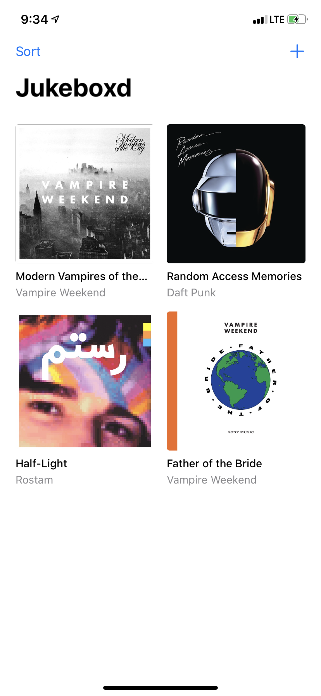
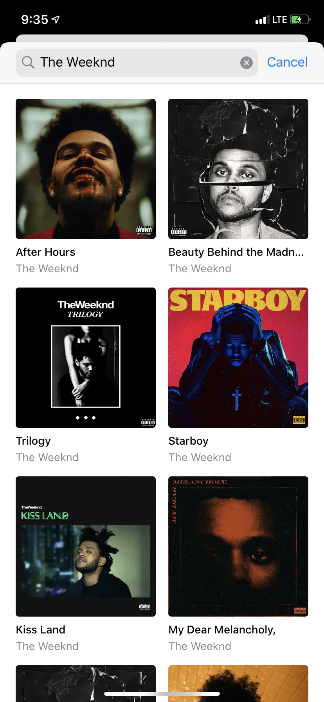
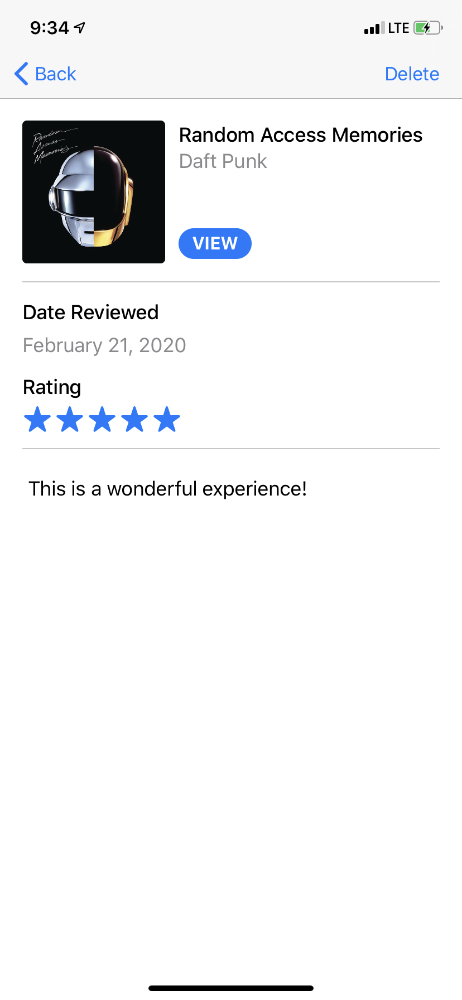

# Jukeboxd New Hire Document

Welcome to **Jukeboxd**, the best way to record your listening habits! We’re so lucky to have you on board to help us ship our brand-new iOS app. Here's a taste of what it will look like!

 

 

We’re still working through some bugs created by Matt, one of our other developers who’s on _thin ice_. Heh, just a little Jukeboxd joke, we’d never fire Matt because his music taste is too good. But enough of that, let’s get started!

## TODOs

While Matt couldn’t code his way out of a Mac Pro packaging box, he was kind enough to leave detailed notes and instructions for all of the bugs his code. You'll have to fix some of these bugs before you're able to get to other ones, so use this reccomended order below.

### Order

1. **TODO:** Create the add review button! (Part 1)
2. **TODO:** Create the add review button! (Part 2)
3. **TODO:** Create the iTunes API search endpoint!
4. **TODO:** Set up a review!
5. **TODO:** Add layout constraints to the detail UILabel!
6. **TODO:** Add the proper styling for this UILabel!
7. **TODO:** Save a review!
8. **TODO:** Enable the album sorting logic!

Every time you fix a bug, try running the app to see your handiwork!

## Instructions

1. On the [main GitHub page](https://github.com/mattbarker016/jukeboxd/tree/tutorial), select the green **Clone or Download** button, and then select **Download ZIP**.
2. Download [**Xcode**](https://apps.apple.com/us/app/xcode/id497799835?mt=12) and use it to open **`Jukeboxd.xcodeproj`**.
3. Open the Search Navigator in the left panel of Xcode, and search for **`TODO:`** within the project.

## Resources

Make sure you check out that handy [Swift Crash Course in Swift](https://www.icloud.com/iclouddrive/0QK5EbdEyPoPO8U86X_E8N69A#A_Swift_Crash_Course_in_Swift) playground for some lessons in using Swift. The **One More Thing** page will help you getting [Xcode](https://apps.apple.com/us/app/xcode/id497799835?mt=12) running and troubleshooting any issues you face.

## Extras

If you have some extra time, there’s some additional features we’d love to implement in our app! You can consult with Matt if you want for any implementation details, but you’ll be the real brains of the operation. 

### Saving selected sorting preferences

The app doesn’t save a user’s preferred sorting preference. We’d love to persist the last selected sorting preference to use when we launch the app every time.

### Open in Spotify / Apple Music directly

That [album.link](https://album.link) site is cool or whatever, but wouldn’t it be awesome if you could tap “View” and just open the app of a superior music streaming service? Or, even better, if the user could pick their preferred service to open? There’s an [API](https://github.com/songlink/docs/blob/master/api-v1-alpha.1.md) for that!

### Have any ideas? Add some of yours!

## That's All, Folks!

Let me know if you have any questions! I'm as excited as you are to see you complete this app, and where you can take it from here 💙
