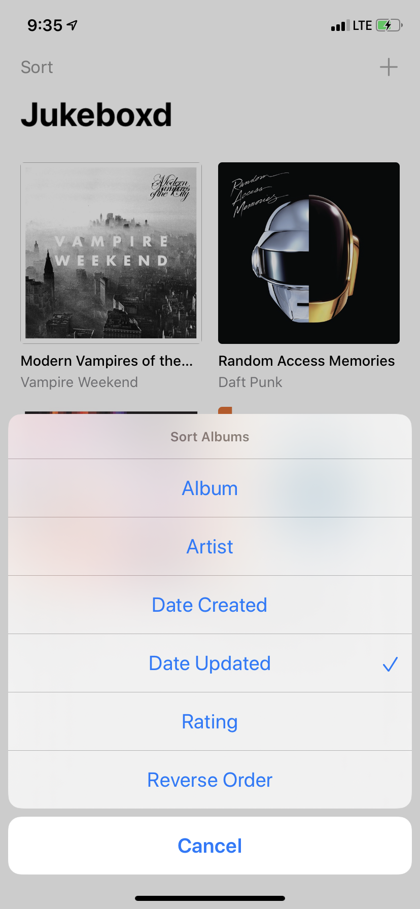
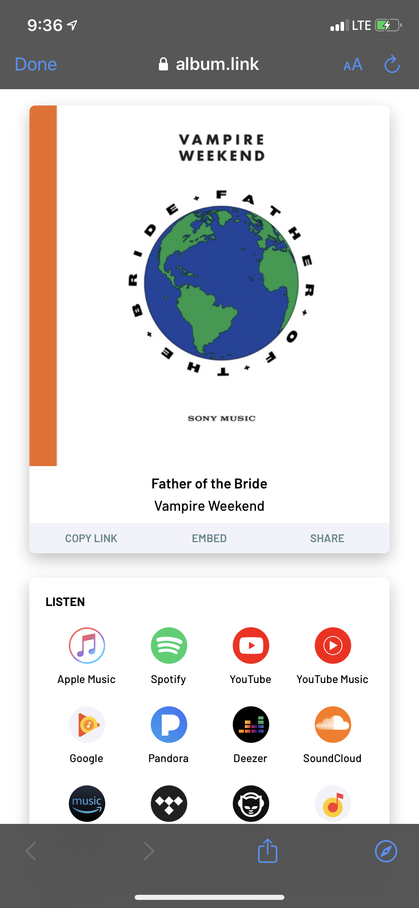
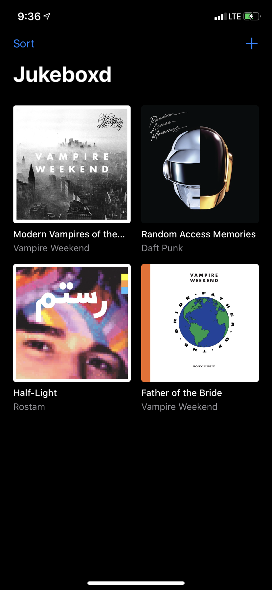

# If your name is Megan She, don't look at this!

This branch contains the **answer key** to your lovely Valentine's day project on the `tutorial` branch. If you're stumped on a `TODO`, just ask me :)

# To everyone else...

Sorry about that, you probably know what you're doing :)

# Jukeboxd

Welcome to **Jukeboxd**, the best way to record your listening habits! Search for your favorite albums, rate and review them, and curate your personal album collection.

 

 

You can sort albums by a variety of options, easily view your album in your favorite streaming service with [album.link](album.link), and that's about it!

 

 

# About

Jukeboxd is a demo app I made for personal use to help teach others about iOS development. This is not intended for distribution or sale. Jukeboxd is open-source and free for anyone to fork or use.

Feel free to contact me for any questions!
